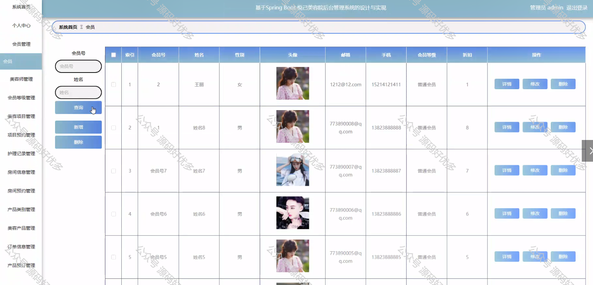

 
## 查看主页获取源码

### 一、作品包含

源码+数据库+设计文档万字+PPT+全套环境和工具资源+部署教程

### 二、项目技术

前端技术：Html、Css、Js、Vue、Element-ui

数据库：MySQL

后端技术：Java、Spring Boot、MyBatis

  

### 三、运行环境

开发工具：IDEA/eclipse

数据库：MySQL5.7

数据库管理工具：Navicat10以上版本

环境配置软件： JDK1.8+Maven3.6.3

前端Nodejs：14

### 四、项目介绍
项目编号：springbootA315

在美容行业竞争日益激烈的当下，提升服务质量和客户体验成为美容院发展的关键。悦己美容院管理系统的推出，正是为了满足这一需求。该系统通过集成信息化管理手段，旨在帮助美容院优化业务流程、提高工作效率、精细化客户管理，从而在市场中脱颖而出，实现可持续发展。

前台用户功能：浏览首页、热门景点、酒店信息、推荐线路、旅游攻略、景点资讯、后台管理、个人中心。

后台分为管理员、会员、美容师
管理员的功能：系统首页、个人中心、会员管理、美容师管理、会员等级管理、美容项目管理、项目预约管理、护理记录管理、房间信息管理、房间预约管理、产品类型管理、美容产品管理、订单信息管理、产品预订管理。
会员的功能：系统首页、个人中心、美容项目管理、项目预约管理、护理记录管理、房间信息管理、房间预约管理、美容产品管理、订单信息管理、产品预订管理。
美容师的功能：系统首页、个人中心、美容项目管理、项目预约管理、护理记录管理、房间信息管理、房间预约管理、美容产品管理、订单信息管理、产品预订管理。

### 五、运行截图

  
